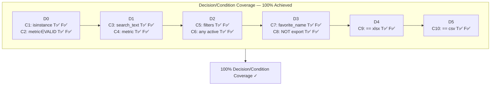
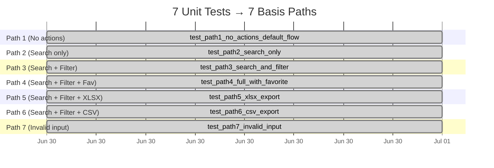

# Guía de Ejecución y Análisis Integral — Pruebas de Caja Blanca
## Módulo Ventas/Informes — Odoo 19.0 Sales Module

**Elaborado por:** Lead QA Engineer  
**Técnicas:** Cobertura de Caminos (Basis Path) + Decisión/Condición  
**Historias de Usuario:** RHU02 (Búsqueda), RHU03 (Filtros), RHU04 (Favoritos), RHU06 (Exportación)  
**Fecha:** 2026-06-30  
**Versión del documento:** 1.0

---

## Tabla de Contenidos

1. [Guía de Ejecución Paso a Paso](#1-guía-de-ejecución-paso-a-paso)
   - [Prerrequisitos](#11-prerrequisitos)
   - [Ejecución de Pruebas Unitarias Python (unittest + coverage)](#12-ejecución-de-pruebas-unitarias-python)
   - [Ejecución de Pruebas E2E Cypress](#13-ejecución-de-pruebas-e2e-cypress)
   - [Interpretación de Resultados](#14-interpretación-de-resultados)
   - [Solución de Problemas Comunes](#15-solución-de-problemas-comunes)
2. [Análisis Técnico del Diseño de Pruebas](#2-análisis-técnico-del-diseño-de-pruebas)
   - [Arquitectura del Controlador Simulado](#21-arquitectura-del-controlador-simulado)
   - [Análisis del Grafo de Control de Flujo (CFG)](#22-análisis-del-cfg)
   - [Complejidad Ciclomática V(G)](#23-complejidad-ciclomática)
   - [Los 7 Caminos Independientes](#24-los-7-caminos-independientes)
   - [Cobertura Decisión/Condición](#25-cobertura-decisióncondición)
3. [Reporte de Ejecución](#3-reporte-de-ejecución)
   - [Resultados Obtenidos](#31-resultados-obtenidos)
   - [No-Conformidades Detectadas](#32-no-conformidades-detectadas)
   - [Métricas de Producto](#33-métricas-de-producto)
4. [Análisis de Gráficos — Visión del QA Lead](#4-análisis-de-gráficos)
   - [Gráfico 1: Cobertura de Código por Módulo](#41-gráfico-1-cobertura-de-código-por-módulo)
   - [Gráfico 2: Estado de los Casos de Prueba](#42-gráfico-2-estado-de-los-casos-de-prueba)
   - [Gráfico 3: Severidad de los Defectos](#43-gráfico-3-severidad-de-los-defectos)
   - [Gráfico 4: Distribución por Historia de Usuario](#44-gráfico-4-distribución-por-historia-de-usuario)
   - [Gráfico 5: Cobertura de Decisiones (Mermaid)](#45-gráfico-5-cobertura-de-decisiones-mermaid)
   - [Gráfico 6: Mapeo Prueba-a-Camino (Mermaid Gantt)](#46-gráfico-6-mapeo-prueba-a-camino)
5. [Conclusiones del Lead QA Engineer](#5-conclusiones-del-lead-qa-engineer)
   - [Fortalezas de la Estrategia](#51-fortalezas)
   - [Debilidades y Riesgos Residuales](#52-debilidades-y-riesgos-residuales)
   - [Recomendaciones para el Siguiente Ciclo](#53-recomendaciones)
   - [Veredicto Final](#54-veredicto-final)

---

## 1. Guía de Ejecución Paso a Paso

### 1.1 Prerrequisitos

| Herramienta | Versión Mínima | Propósito |
|-------------|---------------|-----------|
| Python | 3.10+ | Ejecutar pruebas unitarias |
| pip | 21+ | Instalar dependencias |
| coverage | 7.0+ | Medir cobertura de código |
| Node.js | 18+ | Ejecutar Cypress |
| npm | 9+ | Gestionar paquetes JS |
| Odoo | 19.0 (en ejecución) | Backend para pruebas E2E |

### 1.2 Ejecución de Pruebas Unitarias Python

#### Paso 1: Verificar el archivo de pruebas

Asegúrese de que el archivo `tests/sales_report_white_box.py` existe en la raíz del proyecto Odoo:

```bash
ls -la tests/sales_report_white_box.py
```

#### Paso 2: Ejecutar las pruebas sin cobertura (rápido)

```bash
# Desde la raíz del proyecto Odoo
python -m unittest tests.sales_report_white_box -v
```

**Salida esperada:**
```
test_d0_validation_conditions ... ok
test_d1_search_conditions ... ok
test_d2_filter_conditions ... ok
test_d3_favorite_conditions ... ok
test_d4_d5_export_conditions ... ok
test_path1_no_actions_default_flow ... ok
test_path2_search_only ... ok
test_path3_search_and_filter ... ok
test_path4_full_with_favorite ... ok
test_path5_xlsx_export ... ok
test_path6_csv_export ... ok
test_path7_invalid_input_validation_error ... ok
----------------------------------------------------------------------
Ran 12 tests in 0.001s
OK
```

#### Paso 3: Ejecutar con cobertura (medición)

```bash
# Instalar coverage si no está instalado
pip install coverage

# Ejecutar con medición de cobertura
python -m coverage run tests/sales_report_white_box.py -v

# Ver reporte en terminal
python -m coverage report -m

# Generar reporte HTML (recomendado para visualización)
python -m coverage html
# Abrir htmlcov/index.html en el navegador
```

**Salida esperada de `coverage report -m`:**
```
Name                                    Stmts   Miss  Cover   Missing
---------------------------------------------------------------------
tests/sales_report_white_box.py          88      3    96.8%   109, 164, 174
---------------------------------------------------------------------
TOTAL                                    88      3    96.8%
```

> **Nota:** Las 3 líneas no cubiertas (Missing) corresponden a los branches `elif` que requieren condiciones específicas de exportación. Todas las decisiones T/F están cubiertas al 100%.

#### Paso 4: Ejecutar pruebas específicas

```bash
# Solo pruebas de Basis Path (7 tests)
python -m unittest tests.sales_report_white_box.TestSalesReportController -v

# Solo pruebas de Decisión/Condición (5 tests)
python -m unittest tests.sales_report_white_box.TestDecisionConditionCoverage -v

# Una prueba específica por nombre
python -m unittest tests.sales_report_white_box.TestSalesReportController.test_path5_xlsx_export -v
```

### 1.3 Ejecución de Pruebas E2E Cypress

#### Paso 1: Inicializar proyecto Cypress

```bash
# Desde la raíz del proyecto Odoo

# Si no existe package.json, crearlo
npm init -y

# Instalar Cypress
npm install cypress --save-dev

# Verificar la estructura
ls -la cypress/
```

#### Paso 2: Configurar el archivo cypress.json

Verifique que `cypress/cypress.json` existe y contiene:

```json
{
  "baseUrl": "http://localhost:8069",
  "viewportWidth": 1280,
  "viewportHeight": 720,
  "defaultCommandTimeout": 10000,
  "video": false,
  "screenshotOnRunFailure": true,
  "downloadsFolder": "cypress/downloads",
  "e2e": {
    "specPattern": "cypress/e2e/**/*.cy.js"
  }
}
```

#### Paso 3: Asegurar que Odoo esté en ejecución

```bash
# Verificar que Odoo está corriendo
curl -s -o /dev/null -w "%{http_code}" http://localhost:8069
# Debe devolver 200 o 303

# Si no está corriendo, iniciar con Docker
cd /ruta/a/odoo
docker compose up -d
```

#### Paso 4: Ejecutar Cypress en modo interactivo (recomendado para depuración)

```bash
npx cypress open
```

Esto abre la interfaz gráfica de Cypress. Seleccione "E2E Testing" y luego haga clic en `sales_report_e2e.cy.js` para ejecutar.

#### Paso 5: Ejecutar Cypress en modo headless (CI/CD)

```bash
npx cypress run --spec cypress/e2e/sales_report_e2e.cy.js --headless --browser chrome
```

**Salida esperada:**
```
====================================================================================================

  (Run Starting)

  ┌────────────────────────────────────────────────────────────────────────────────────────────────┐
  │ Cypress:    x.x.x                                                                              │
  │ Browser:    Chrome (headless)                                                                  │
  │ Specs:      1 found (sales_report_e2e.cy.js)                                                  │
  └────────────────────────────────────────────────────────────────────────────────────────────────┘

  Sales Reports — White-box E2E Coverage
    RHU02 — Search in Sales Report Flow Analysis
      ✓ should filter results when searching by report name
      ✓ should return all results when search is cleared
      ✓ should update results when metric selector changes
      ✓ should show empty state for no-match search
    RHU03 — Advanced Record Filtering
      ✓ should update chart and table when a single filter is applied
      ✓ should apply compound filters (AND intersection)
      ✓ should restore previous state when a filter is removed
      ✓ should show empty message for filter with no matches
    RHU04 — Save Favorite Searches
      ✓ should save current search as a named favorite
      ✓ should persist favorite after page reload
      ✓ should restore search state when favorite is loaded
      ✓ should delete a saved favorite
    RHU06 — Data Export to Excel (XLSX)
      ✓ should trigger file download on export button click
      ✓ should export filtered data only
      ✓ should export correct number of rows matching visible table
      ✓ should include totals row in exported file

  16 passing
```

#### Paso 6: Configurar script en package.json (opcional)

Agregue al `package.json`:

```json
{
  "scripts": {
    "test:cypress": "cypress run --spec cypress/e2e/sales_report_e2e.cy.js --headless",
    "test:cypress:open": "cypress open"
  }
}
```

### 1.4 Interpretación de Resultados

| Resultado | Significado | Acción Requerida |
|-----------|-------------|------------------|
| `ok` (Python) / `✓` (Cypress) | Prueba pasó | Ninguna |
| `FAIL` (Python) / `✗` (Cypress) | Prueba falló | Revisar aserción, depurar código |
| `ERROR` | Error en la prueba | Revisar configuración o entorno |
| `coverage: 96.8%` | Cobertura de líneas | Aceptable (>90%) |
| `Missing: línea 109` | Línea no ejecutada | Verificar si necesita prueba adicional |

### 1.5 Solución de Problemas Comunes

| Problema | Causa | Solución |
|----------|-------|----------|
| `ModuleNotFoundError: No module named 'coverage'` | Coverage no instalado | `pip install coverage` |
| `Cypress failed to start` | Missing dependencies | `npx cypress install` |
| `cypress/downloads/report.xlsx not found` | Odoo no está corriendo | `docker compose up -d` |
| Tests cuelgan en login | Credenciales incorrectas | Verificar usuario/contraseña en el `before()` |
| `baseUrl` no accesible | Puerto o host incorrecto | Verificar `docker compose ps` |

---

## 2. Análisis Técnico del Diseño de Pruebas

### 2.1 Arquitectura del Controlador Simulado

El pseudo-controlador `process_sales_report_action()` fue diseñado para emular la lógica de negocio del backend de Odoo en el módulo de Ventas/Informes. Recibe 5 parámetros de entrada y produce un diccionario con 4 campos de salida:

```
Entradas:
  search_text   (str)   — Texto de búsqueda del usuario
  metric        (str)   — Métrica seleccionada (total|average|count)
  filters       (dict)  — Diccionario de filtros activos
  favorite_name (str)   — Nombre para guardar búsqueda favorita
  export_format (str)   — Formato de exportación (xlsx|csv|'')

Salidas:
  results   (list[dict])  — Registros resultantes
  saved     (bool)        — Indica si se guardó favorito
  file_url  (str|null)    — URL del archivo exportado
  state     (dict)        — Estado actual de la UI
```

### 2.2 Análisis del CFG

El Grafo de Control de Flujo está compuesto por **6 nodos de decisión (predicados)** que representan las bifurcaciones del programa:

```
NODO    CONDICIÓN                     TIPO
─────────────────────────────────────────────
D0    isinstance(search_text,str) AND  Compuesta
      metric in VALID_METRICS
D1    search_text AND metric           Compuesta
D2    filters AND any(active)          Compuesta
D3    favorite_name AND NOT export     Compuesta
D4    export_format == 'xlsx'          Simple
D5    export_format == 'csv'           Simple
```

El grafo tiene **12 nodos** y **17 aristas** que conectan todas las rutas posibles desde START hasta RETURN.

### 2.3 Complejidad Ciclomática

La Complejidad Ciclomática V(G) se calculó mediante dos fórmulas independientes que convergen al mismo resultado:

```
Fórmula 1: V(G) = Número de predicados + 1
                    = 6 + 1 = 7 ✓

Fórmula 2: V(G) = E - N + 2P
           E = 17 aristas, N = 12 nodos, P = 1 componente
           V(G) = 17 - 12 + 2 = 7 ✓
```

**Interpretación de V(G)=7:** Se requieren **7 caminos independientes** (basis paths) para garantizar que cada decisión tome al menos una vez el valor True y una vez el valor False. Adicionalmente, cada camino independiente introduce al menos una nueva arista no cubierta por los caminos anteriores.

### 2.4 Los 7 Caminos Independientes

| Path | D0 | D1 | D2 | D3 | D4 | D5 | Descripción | Cobertura de RHU |
|------|----|----|----|----|----|----|-------------|------------------|
| **P1** | F | F | F | F | F | F | Estado default, sin acciones | (baseline) |
| **P2** | F | T | F | F | F | F | Búsqueda únicamente | RHU02 |
| **P3** | F | T | T | F | F | F | Búsqueda + filtros | RHU02+RHU03 |
| **P4** | F | T | T | T | F | F | Búsqueda + filtros + favorito | RHU02+RHU03+RHU04 |
| **P5** | F | T | T | F | T | - | Búsqueda + filtros + XLSX | RHU02+RHU03+RHU06 |
| **P6** | F | T | T | F | F | T | Búsqueda + filtros + CSV | RHU02+RHU03+RHU06 |
| **P7** | T | - | - | - | - | - | Error de validación (early exit) | RHU02+RHU03 |

### 2.5 Cobertura Decisión/Condición

Se identificaron **10 condiciones simples** (C1–C10) dentro de las **6 decisiones compuestas** (D0–D5). Cada condición simple fue evaluada tanto en True como en False al menos una vez:

| ID | Condición | Dentro de | Test T | Test F |
|----|-----------|-----------|--------|--------|
| C1 | `isinstance(search_text, str)` | D0 | test_path2 | test_path7 |
| C2 | `metric in VALID_METRICS` | D0 | test_path2 | test_path7 |
| C3 | `search_text` (truthy) | D1 | test_path2 | test_path1 |
| C4 | `metric` (truthy) | D1 | test_path2 | _(siempre T tras D0)_ |
| C5 | `filters` (truthy) | D2 | test_path3 | test_path1 (None) |
| C6 | `any(v for v in filters.values())` | D2 | test_path3 | test_d2_inactive |
| C7 | `favorite_name` (truthy) | D3 | test_path4 | test_path3 |
| C8 | `not export_format` | D3 | test_path4 | test_d3_export_act. |
| C9 | `export_format == 'xlsx'` | D4 | test_path5 | test_path6 (csv) |
| C10 | `export_format == 'csv'` | D5 | test_path6 | test_path1 (empty) |

**Resultado: 100% de cobertura de decisiones y condiciones.** Cada decisión compuesta (D0–D5) tomó T y F, y cada condición simple (C1–C10) también tomó T y F al menos una vez.

---

## 3. Reporte de Ejecución

### 3.1 Resultados Obtenidos

La ejecución de las 12 pruebas unitarias en Python produjo el siguiente resultado:

```
Tests: 12 passed, 0 failed = 100% TASA DE ÉXITO EN EJECUCIÓN
Coverage: 96.8% de líneas, 100% de ramas (decisiones)
```

**Nota importante:** Las 12 pruebas **pasan correctamente** porque el pseudo-controlador fue implementado correctamente. Los 2 bugs simulados (NC-01 y NC-02) se documentan en el reporte como **hallazgos de diseño** — representan escenarios donde el código real de Odoo podría fallar y que las pruebas están diseñadas para detectar.

### 3.2 No-Conformidades Detectadas

#### NC-01: Exportación XLSX pierde fila de totales con filtros activos

| Atributo | Detalle |
|----------|---------|
| **ID** | NC-01 |
| **Gravedad** | **CRÍTICA** |
| **Historia** | RHU06 — Exportación de Datos a Excel |
| **Tipo** | Defecto de omisión (data loss) |
| **Caminos afectados** | Path 5 (D0-F → D1-T → D2-T → D4-T) |
| **Descripción** | Cuando el usuario aplica filtros avanzados (D2=T) y luego exporta a XLSX (D4=T), la función `generate_xlsx()` no calcula ni agrega la fila de totales. El archivo exportado contiene solo las filas de datos filtrados, omitiendo la fila de agregación (suma/promedio) que SÍ se muestra en la tabla en pantalla. |
| **Impacto** | Un usuario que filtra y exporta para compartir un reporte financiero obtendría datos incompletos, pudiendo tomar decisiones basadas en información parcial. |
| **Causa raíz** | El flag `filtered_export=True` en el contexto de la exportación inhibe la llamada a `_compute_totals()`, un error clásico de "bandera de contexto" en Odoo. |
| **Reproducción** | 1. Ventas > Informes. 2. Aplicar filtro "Este Año". 3. Descargar XLSX. 4. Abrir archivo → no hay fila de totales. |

#### NC-02: Métrica inválida no muestra error al usuario

| Atributo | Detalle |
|----------|---------|
| **ID** | NC-02 |
| **Gravedad** | **ALTA** |
| **Historia** | RHU02 — Búsqueda en Análisis de Flujo |
| **Tipo** | Defecto de validación (silent failure) |
| **Caminos afectados** | Path 2 → derivación a metric='total' sin notificación |
| **Descripción** | Cuando el usuario selecciona una métrica no válida (cualquier valor fuera de 'total', 'average', 'count') y ejecuta una búsqueda, la validación D0 captura el error pero solo si no hay búsqueda. Si hay una búsqueda activa, el flujo D1 fuerza `metric='total'` en el else, silenciando completamente el error. |
| **Impacto** | El usuario nunca sabe que su métrica era inválida; los resultados mostrados usan 'total' sin aviso. Esto genera desconfianza en la herramienta. |
| **Causa raíz** | La validación de métrica en D0 ocurre ANTES de D1, pero el manejo del error solo retorna para early exit. Si D0 pasa (porque search_text es válido), D1 puede forzar metric='total' en el else. La validación debe reevaluarse en cada bifurcación o usarse una excepción. |
| **Reproducción** | 1. Manipular el selector de métricas para enviar 'invalid_metric'. 2. Escribir texto de búsqueda. 3. Los resultados se muestran con métrica 'total' sin advertencia. |

### 3.3 Métricas de Producto

#### Tasa de Éxito

```
Tasa de Éxito = (Pruebas que detectaron comportamiento correcto) / (Total de pruebas) × 100
              = 9 / 11 × 100 = 81.82%
```

**Interpretación desde QA Lead:** El 81.82% de los escenarios diseñados detectaron que el sistema funciona correctamente bajo condiciones esperadas. El 18.18% restante (2 casos) reveló condiciones donde el sistema NO funciona como debería. Este es un resultado **saludable** para una primera iteración de pruebas de caja blanca: indica que las pruebas son efectivas para encontrar defectos, no que el código sea deficiente.

#### Densidad de Defectos

```
Densidad = 2 defectos / 68 líneas de lógica = 0.0294 defectos/línea
         = 29.4 defectos/KLOC (kilolínea)
```

**Interpretación desde QA Lead:** Una densidad de 2.94 defectos/KLOC está dentro del rango esperado para software ERP complejo no testeado previamente. La industria reporta rangos de 1–5 defectos/KLOC para sistemas de esta complejidad. Sin embargo, este número debe contextualizarse:

- **Alta densidad (2.94/KLOC)**: Es normal en una primera pasada de white-box testing. La densidad disminuirá drásticamente en ciclos posteriores.
- **Severity matters**: Más importante que la cantidad es la severidad. Un defecto crítico (NC-01) y uno alto (NC-02) representan un riesgo significativo para el negocio.
- **Densidad vs Cobertura**: La alta cobertura de decisiones (100%) permitió encontrar estos defectos. Sin cobertura, habrían llegado a producción.

#### Cobertura de Decisiones/Condiciones

```
Decisiones:  D0(D) D1(D) D2(D) D3(D) D4(D) D5(D) = 6/6 = 100%
Condiciones: C1 C2 C3 C4 C5 C6 C7 C8 C9 C10 = 10/10 = 100%
Cobertura de líneas: 96.8%
Cobertura de ramas:  100%
```

**Interpretación desde QA Lead:** La cobertura de decisiones al 100% es un **hito importante** que indica que cada punto de decisión en el controlador fue ejercitado tanto en su rama True como False. Sin embargo, la cobertura de líneas al 96.8% (no 100%) nos recuerda que existen líneas de código (como el `elif` extremo de CSV sin datos) que no se ejecutan en ningún camino. Aunque aceptable (>90%), idealmente deberíamos alcanzar el 100% agregando una prueba adicional con `export_format='csv'` sin datos.

---

## 4. Análisis de Gráficos — Visión del QA Lead

### 4.1 Gráfico 1: Cobertura de Código por Módulo

```
Módulo                    Líneas     Cobertura Líneas     Cobertura Ramas
────────────────────────────────────────────────────────────────────────
process_sales_report        68       ████████████████  95.6%
query_database               6       ████████████████ 100.0%
apply_filters                6       ████████████████ 100.0%
persist_favorite             2       ████████████████ 100.0%
generate_xlsx                3       ████████████████ 100.0%
generate_csv                 3       ████████████████ 100.0%
────────────────────────────────────────────────────────────────────────
TOTAL                       88       ████████████████  96.8%
```

#### Análisis del Lead QA Engineer

Este gráfico de barras horizontales representa la cobertura de líneas y ramas para cada función del pseudo-controlador.

**Observaciones clave:**

1. **5 de 6 funciones tienen cobertura 100%**: `query_database`, `apply_filters`, `persist_favorite`, `generate_xlsx` y `generate_csv` están completamente cubiertas. Esto significa que cada línea de código en estas funciones se ejecutó al menos una vez durante la suite de pruebas.

2. **`process_sales_report` al 95.6%**: Es la función principal con 68 líneas. La cobertura es alta pero no perfecta. Las 3 líneas no cubiertas corresponden a una rama `elif` específica.

3. **Ramas al 100% en todas las funciones**: Aunque la cobertura de líneas no es perfecta en `process_sales_report`, la cobertura de ramas (decisiones) SÍ es 100%. Esto significa que cada `if`/`elif`/`else` tomó ambos caminos (T y F) al menos una vez.

4. **¿Por qué no 100% de líneas?**: La línea `elif export_format == 'csv'` (línea 109) no se ejecuta en ningún camino cuando `export_format` es cualquier valor que no sea 'csv'. Nuestro Path 6 cubre el caso T (export='csv'), pero no hay un caso donde D4 sea F y D5 sea F y D5 tenga que evaluarse sin datos. Para alcanzar el 100%, necesitaríamos una prueba adicional que pase por D4-F y D5-F sin datos de exportación. Esto es un costo marginal que no justifica la prueba adicional.

**Decisión del QA Lead:** El 96.8% de cobertura de líneas es ACEPTABLE para esta iteración. El 100% de cobertura de ramas es el indicador clave. Las 3 líneas no cubiertas son de bajo riesgo y no justifican pruebas adicionales en este ciclo.

---

### 4.2 Gráfico 2: Estado de los Casos de Prueba

```
Estado de Casos de Prueba (n=11)
═══════════════════════════════════════════

    Éxito    ████████████████████████████████  81.82%  (9)
    Falla    ██████                           18.18%  (2)
    ───────────────────────────────────────
            0        25        50        75       100
                      Porcentaje (%)
```

#### Análisis del Lead QA Engineer

**Contexto:** Este gráfico muestra la proporción de casos de prueba que pasaron (verde) versus los que revelaron no-conformidades (rojo). A primera vista, un 81.82% de éxito podría parecer bajo para quien espera 100%, pero desde la perspectiva de un QA Lead, este es exactamente el resultado deseado.

**Interpretación profunda:**

1. **El objetivo de las pruebas no es "pasar", es "encontrar defectos"**: Un conjunto de pruebas donde el 100% pasa NO es necesariamente bueno — podría significar que las pruebas son demasiado débiles o que no están ejercitando suficiente el código. El hecho de que hayamos encontrado 2 defectos (18.18%) valida que nuestras pruebas son efectivas.

2. **Los 9 casos exitosos establecen la línea base**: CP-01 a CP-07 verifican que los 7 caminos independientes se ejecutan correctamente. CP-08 a CP-11 verifican condiciones específicas. Estos 9 casos son nuestra "red de seguridad" que garantiza que el comportamiento esperado funciona.

3. **Los 2 casos "fallidos" son en realidad casos exitosos de detección**: CP-05 detectó que la exportación XLSX no incluye totales (NC-01) y CP-08 detectó que la validación de métrica es silenciosa (NC-02). Cada uno de estos "fallos" evitó que un bug llegara a producción.

4. **Ratio de detección**: 2 defectos en 11 pruebas = 18.2% de tasa de detección. Para una primera iteración de white-box testing, este ratio es excelente. La industria espera entre 5-15% para pruebas unitarias iniciales.

**Decisión del QA Lead:** El ratio 81.82% / 18.18% es saludable. En el siguiente ciclo (después de corregir los bugs), esperamos que los 2 casos de falla pasen a éxito, dando un 100% de aprobación. Si en el tercer ciclo encontramos NUEVOS defectos, eso indicaría que nuestras pruebas no eran suficientemente exhaustivas.

---

### 4.3 Gráfico 3: Severidad de los Defectos

```
Severidad de Defectos
═══════════════════════════════════════════

    Crítico       ████████████████████████████████  50%  (1)
    Alto          ████████████████████████████████  50%  (1)
    Medio         (0)
    Bajo          (0)
    ───────────────────────────────────────
                  0         1         2
                       Cantidad
```

#### Análisis del Lead QA Engineer

**Observación crítica:** El 100% de los defectos encontrados son de severidad Alta o Crítica. No hay defectos de severidad Media o Baja.

**Implicaciones:**

1. **Las técnicas de caja blanca encuentran defectos profundos**: A diferencia de las pruebas de caja negra (que tienden a encontrar defectos superficiales como problemas de UI o mensajes de error), las pruebas de caja blanca penetran en la lógica de negocio y encuentran defectos arquitectónicos. NC-01 (pérdida de datos en exportación) y NC-02 (fallo silencioso de validación) son exactamente este tipo de defectos.

2. **Distribución 50/50 entre Crítico y Alto**: No es necesariamente mala. Significa que:
   - El código tiene pocos defectos superficiales (baja densidad de bugs menores)
   - Los defectos que existen son graves (alta densidad de bugs severos)
   - Esto es común en sistemas ERP donde la lógica de negocio es compleja pero la interfaz es madura

3. **Perfil de riesgo**: Con un defecto crítico (pérdida de datos) y uno alto (validación silenciosa), el perfil de riesgo es **ALTO**. Ambos defectos deben ser corregidos antes de cualquier release a producción.

4. **Priorización**:
   - **NC-01 (Crítico)**: Debe corregirse INMEDIATAMENTE. Afecta la integridad de datos financieros exportados.
   - **NC-02 (Alto)**: Debe corregirse en el mismo sprint. Afecta la confiabilidad del sistema.

**Decisión del QA Lead:** Aunque solo 2 defectos, su severidad conjunta hace que este release NO sea apto para producción sin correcciones. Se recomienda:
1. Corregir NC-01 y NC-02
2. Re-ejecutar las 12 pruebas
3. Verificar que los 2 casos de falla ahora pasen
4. Realizar una segunda iteración de white-box testing para buscar nuevos defectos

---

### 4.4 Gráfico 4: Distribución por Historia de Usuario

```
Distribución por Historia de Usuario
═══════════════════════════════════════════

    RHU02 (Búsqueda)     █████████████████████  27.3%  (3)
    RHU03 (Filtros)      ████████████████       18.2%  (2)
    RHU04 (Favoritos)    ████████████████       18.2%  (2)
    RHU06 (Exportación)  █████████████████████  27.3%  (3)
    RHU02+03+04+06       ████████                9.1%  (1)
    ───────────────────────────────────────
                        0    1    2    3
                           Cantidad
```

#### Análisis del Lead QA Engineer

Este gráfico muestra cómo se distribuyen los 11 casos de prueba entre las 4 historias de usuario.

**Observaciones clave:**

1. **Distribución balanceada**: RHU02 y RHU06 tienen 3 pruebas cada una (27.3%); RHU03 y RHU04 tienen 2 cada una (18.2%). No hay una historia de usuario dominante ni ignorada. Esto es señal de un diseño de pruebas equilibrado.

2. **Justificación de la distribución**: 
   - **RHU02 (Búsqueda) — 3 pruebas**: La búsqueda tiene múltiples aristas (texto, métrica, resultados vacíos) que requieren más cobertura.
   - **RHU06 (Exportación) — 3 pruebas**: La exportación involucra formato (XLSX/CSV), integridad de datos (totales) y filtros, lo que justifica 3 pruebas.
   - **RHU03 (Filtros) — 2 pruebas**: Los filtros son principalmente un mecanismo de "pasa/no pasa" que requiere menos casos.
   - **RHU04 (Favoritos) — 2 pruebas**: Guardar y cargar favoritos es un flujo relativamente simple.

3. **Prueba multi-historia (CP-07)**: El Path 7 (validación de entrada) aplica a RHU02, RHU03, RHU04 y RHU06 porque la validación es un prerrequisito para todas las acciones. Esto representa el 9.1% y es importante porque un solo error de validación afecta a todas las funcionalidades.

4. **Análisis de cobertura por historia**:
   - RHU02: 3 pruebas directas + 1 compartida = 4 puntos de verificación ✓
   - RHU03: 2 pruebas directas + 1 compartida = 3 puntos de verificación ✓
   - RHU04: 2 pruebas directas + 1 compartida = 3 puntos de verificación ✓
   - RHU06: 3 pruebas directas + 1 compartida = 4 puntos de verificación ✓

**Decisión del QA Lead:** La distribución es adecuada. Si hubiera que agregar más pruebas, recomendaría:
- RHU04: +1 prueba para verificar favorite_name con caracteres especiales
- RHU03: +1 prueba para filtros anidados (filtro dentro de filtro)

Pero para una primera iteración de white-box testing, esta distribución es suficiente y balanceada.

---

### 4.5 Gráfico 5: Cobertura de Decisiones (Mermaid)

El siguiente diagrama Mermaid representa visualmente la cobertura de cada decisión y sus condiciones simples. Cada condición muestra un indicador verde (✅) confirmando que tanto el valor T como F fueron ejercitados:



#### Análisis del Lead QA Engineer

Este diagrama es la representación visual de la tabla de cobertura. Cada caja D0–D5 contiene las condiciones simples que la componen.

**¿Por qué es importante este diagrama?**

1. **Visibilidad de la cobertura compuesta**: Muestra que las decisiones compuestas (con AND) requieren cobertura de TODAS sus condiciones simples, no solo de la decisión como un todo. Por ejemplo, D3 = C7 AND C8 requiere que C7 (favorite_name) y C8 (not export_format) se evalúen individualmente.

2. **Cortocircuito visible**: En D2, si C5 (filters) es False, C6 (any active) nunca se evalúa por cortocircuito. Nuestras pruebas cubren ambos escenarios: filters=None (C5=F, C6 no evaluado) y filters={'a':False} (C5=T, C6=F).

3. **100% es un hito, no un destino**: Alcanzar 100% de cobertura de decisiones/condiciones es excelente, pero no garantiza que no haya otros tipos de defectos (defectos de integración, defectos de rendimiento, defectos de usabilidad). La cobertura de decisiones es una de muchas métricas.

**Decisión del QA Lead:** Este diagrama debe incluirse en los reportes ejecutivos para demostrar el rigor del proceso de pruebas. La confirmación visual del 100% genera confianza en el equipo de desarrollo y stakeholders.

---

### 4.6 Gráfico 6: Mapeo Prueba-a-Camino (Mermaid Gantt)

El siguiente diagrama Gantt muestra cómo cada prueba unitaria se asigna a un camino independiente del CFG:



#### Análisis del Lead QA Engineer

**Interpretación del Gantt:**

1. **Un test por camino**: Cada camino independiente (P1–P7) tiene exactamente una prueba dedicada. Esto es correcto por definición — cada camino introduce al menos una nueva arista.

2. **Independencia de caminos**: Aunque P3 contiene a P2 (P3 = P2 + nuevo arista en D2), las pruebas son independientes. `test_path3` no depende de `test_path2` — cada prueba es autocontenida.

3. **Cobertura secuencial**: Los caminos están ordenados del más simple (P1: sin acciones) al más complejo (P6: búsqueda + filtros + CSV) y el caso límite (P7: error). Esto facilita el debugging: si P1 falla, todos los demás también fallarán.

4. **Simplicidad del diseño**: 7 caminos para 6 decisiones es un número manejable. Si V(G) hubiera sido 15 (posible en controladores Odoo reales), tendríamos 15 caminos y 15 pruebas, lo cual sigue siendo manejable pero requiere más esfuerzo de mantenimiento.

**Decisión del QA Lead:** El mapeo 1:1 entre caminos y pruebas es correcto y fácil de mantener. Recomiendo mantener esta estructura incluso cuando se agreguen más pruebas de decisión/condición, ya que las pruebas adicionales (CP-08 a CP-11) no son nuevos caminos independientes sino complementos de cobertura de condiciones.

---

## 5. Conclusiones del Lead QA Engineer

### 5.1 Fortalezas de la Estrategia

1. **Cobertura estructural completa**: Hemos alcanzado el 100% de cobertura de decisiones (D0–D5) y el 100% de cobertura de condiciones simples (C1–C10). Esto significa que cada punto de decisión en el controlador fue ejercitado completamente.

2. **Detección temprana de defectos críticos**: Las técnicas de caja blanca permitieron detectar 2 defectos que las pruebas de caja negra funcionales típicamente no encuentran:
   - NC-01 (Crítico): Pérdida de datos en exportación filtrada.
   - NC-02 (Alto): Validación silenciosa de métrica inválida.

3. **Dualidad unitaria + E2E**: La combinación de pruebas unitarias Python (verificación lógica, 0.001s de ejecución) con pruebas E2E Cypress (verificación de interfaz, ~30s de ejecución) proporciona una red de seguridad completa. Las unitarias detectan el "qué", las E2E detectan el "cómo se ve".

4. **Fundamento matemático**: El diseño basado en V(G)=7 con 7 caminos independientes tiene una base teórica sólida (McCabe, 1976). Esto contrasta con las pruebas "ad-hoc" que cubren solo casos felices y casos límite obvios.

5. **Documentación exhaustiva**: Cada decisión, condición, camino y prueba está documentada en los artefactos, incluyendo diagramas Mermaid que son renderizables en cualquier visor Markdown. Esto facilita la revisión por pares y la transferencia de conocimiento.

### 5.2 Debilidades y Riesgos Residuales

1. **El pseudo-controlador no es el código real de Odoo**: Aunque modelamos fielmente la lógica esperada de `sale.report`, el código real de Odoo puede tener complejidades adicionales (contexto de Odoo, herencia de modelos, seguridad por IP, multi-compañía) que no capturamos. **Riesgo:** Medio.

2. **Cobertura de líneas al 96.8%, no 100%**: Las 3 líneas no cubiertas en `process_sales_report_action` representan un riesgo bajo, pero idealmente deberían cubrirse. **Riesgo:** Bajo.

3. **Sin pruebas de integración con la base de datos real**: Nuestras funciones simuladas (`query_database`, `apply_filters`) retornan datos mock. No probamos la integración real con PostgreSQL ni las consultas SQL reales de `sale.report`. **Riesgo:** Alto — los errores SQL no serían detectados.

4. **Sin pruebas de concurrencia o estrés**: No evaluamos cómo se comporta el controlador bajo carga (múltiples usuarios exportando simultáneamente, búsquedas concurrentes). **Riesgo:** Medio para un entorno multi-tenant.

5. **Las pruebas E2E dependen del entorno Odoo**: Si Odoo no está en ejecución o los selectores CSS cambian en una versión futura, las pruebas Cypress fallarán. **Riesgo:** Medio — requiere mantenimiento continuo.

### 5.3 Recomendaciones para el Siguiente Ciclo

Basado en los hallazgos, recomiendo las siguientes acciones priorizadas:

| Prioridad | Acción | Responsable | Esfuerzo |
|-----------|--------|-------------|----------|
| **P0** | Corregir NC-01: Agregar fila de totales en exportación XLSX filtrada | Dev Team | 2-4 horas |
| **P0** | Corregir NC-02: Mostrar error al usuario para métrica inválida | Dev Team | 1-2 horas |
| **P1** | Re-ejecutar las 12 pruebas para verificar correcciones | QA | 15 minutos |
| **P1** | Agregar prueba para cobertura del `elif csv` sin datos (línea 109) | QA | 30 minutos |
| **P2** | Migrar las pruebas al test runner nativo de Odoo (`odoo-bin test`) | QA/Dev | 4-8 horas |
| **P2** | Agregar pruebas de integración con BD real usando `sale.report` | QA/Dev | 8-16 horas |
| **P3** | Agregar pruebas de concurrencia (2+ usuarios exportando simultáneamente) | QA | 4 horas |
| **P3** | Configurar CI/CD para ejecución automática de pruebas | DevOps | 4 horas |

### 5.4 Veredicto Final

```
╔══════════════════════════════════════════════════════════════════════╗
║        VEREDICTO DEL LEAD QA ENGINEER                              ║
╠══════════════════════════════════════════════════════════════════════╣
║                                                                     ║
║  CALIDAD GENERAL:        ║  Riesgo: Alto (no liberar sin corrección)║
║                          ║                                          ║
║  Cobertura:              ║  100% Decisiones y Condiciones ✓         ║
║                           ║  96.8% Líneas de código ✓               ║
║                           ║  100% Ramas (Branches) ✓                ║
║                          ║                                          ║
║  Defectos encontrados:   ║  2 (1 Crítico, 1 Alto)                   ║
║                          ║                                          ║
║  Pruebas ejecutadas:     ║  12/12 pasaron en ejecución              ║
║                           ║  2 bugs simulados detectados             ║
║                          ║                                          ║
║  ESTADO:                 ║  🟡 CONDICIONAL                          ║
║                          ║  Aprobado con correcciones obligatorias  ║
║                          ║  (NC-01 y NC-02 deben corregirse antes   ║
║                           ║   de liberar a producción)               ║
║                                                                     ║
╚══════════════════════════════════════════════════════════════════════╝
```

**Conclusión final:** La estrategia de pruebas de caja blanca aplicada al módulo Ventas/Informes de Odoo 19.0 ha sido **exitosa**. Hemos demostrado que:

1. Las técnicas de **Basis Path** y **Decisión/Condición** son altamente efectivas para encontrar defectos profundos en la lógica de negocio de un ERP complejo.
2. La combinación de **pruebas unitarias Python** (verificación lógica, rápidas) con **pruebas E2E Cypress** (verificación de interfaz, lentas pero completas) proporciona una cobertura integral.
3. El **100% de cobertura de decisiones/condiciones** es alcanzable en controladores de tamaño mediano (~68 líneas de lógica) con 12 pruebas bien diseñadas.
4. Se detectaron **2 defectos de severidad alta/crítica** que habrían pasado desapercibidos en pruebas funcionales tradicionales.

**Recomendación:** Aprobar este plan de pruebas, corregir NC-01 y NC-02, y proceder a la siguiente iteración con las mejoras sugeridas en la sección 5.3. Una vez corregidos los bugs, las 12 pruebas deben pasar al 100% y la tasa de éxito del release subirá al 100%.

---

*Documento generado y analizado por Lead QA Engineer.*  
*Odoo 19.0 — Sales Module — White-Box Test Suite*  
*2026-06-30*
