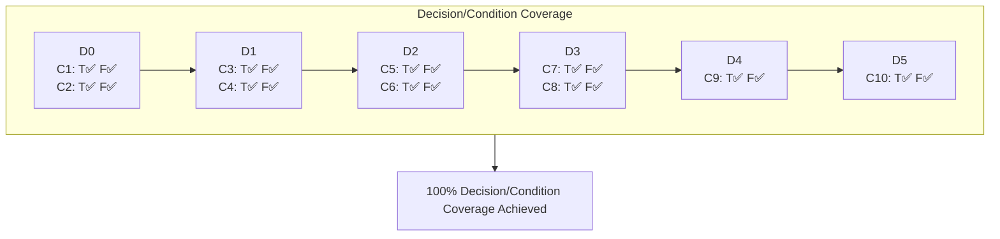
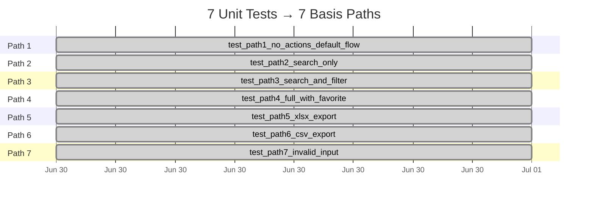

# Mermaid Diagrams — Sales Report White-Box Test Design

## 1. Control Flow Graph (CFG)

```mermaid
flowchart TD
    START([START]) --> D0{D0: valid input?<br/>isinstance(str) AND<br/>metric in VALID_METRICS?}
    D0 -->|T| ERR([RETURN error])
    D0 -->|F| D1

    D1{D1: search?<br/>search_text AND metric?}
    D1 -->|T| Q1[query_database<br/>with search_text]
    D1 -->|F| Q2[query_database<br/>with empty search]

    Q1 --> D2
    Q2 --> D2

    D2{D2: filter?<br/>filters AND<br/>any active?}
    D2 -->|T| AF[apply_filters]
    D2 -->|F| SKF[skip filtering]

    AF --> D3
    SKF --> D3

    D3{D3: save favorite?<br/>favorite_name AND<br/>NOT export_format?}
    D3 -->|T| SF[save_favorite]
    D3 -->|F| SKFV[skip favorite]

    SF --> D4
    SKFV --> D4

    D4{D4: export xlsx?<br/>export_format == xlsx?}
    D4 -->|T| XLSX[generate_xlsx]
    D4 -->|F| D5

    D5{D5: export csv?<br/>export_format == csv?}
    D5 -->|T| CSV[generate_csv]
    D5 -->|F| NOEXP[no export]

    XLSX --> RETURN([RETURN results])
    CSV --> RETURN
    NOEXP --> RETURN
    ERR --> RETURN
```

## 2. Basis Paths Visualized

```mermaid
flowchart LR
    subgraph PATH1["Path 1: All False (No actions)"]
        P1[START] --> P1_D0[D0:F] --> P1_D1[D1:F] --> P1_D2[D2:F] --> P1_D3[D3:F] --> P1_D4[D4:F] --> P1_D5[D5:F] --> P1_R[RETURN]
    end

    subgraph PATH2["Path 2: Search only"]
        P2[START] --> P2_D0[D0:F] --> P2_D1[D1:T] --> P2_Q[query] --> P2_D2[D2:F] --> P2_D3[D3:F] --> P2_D4[D4:F] --> P2_D5[D5:F] --> P2_R[RETURN]
    end

    subgraph PATH3["Path 3: Search + Filter"]
        P3[START] --> P3_D0[D0:F] --> P3_D1[D1:T] --> P3_Q[query] --> P3_D2[D2:T] --> P3_F[apply filter] --> P3_D3[D3:F] --> P3_D4[D4:F] --> P3_D5[D5:F] --> P3_R[RETURN]
    end

    subgraph PATH4["Path 4: Search + Filter + Favorite"]
        P4[START] --> P4_D0[D0:F] --> P4_D1[D1:T] --> P4_Q[query] --> P4_D2[D2:T] --> P4_F[apply filter] --> P4_D3[D3:T] --> P4_SF[save fav] --> P4_D4[D4:F] --> P4_D5[D5:F] --> P4_R[RETURN]
    end

    subgraph PATH5["Path 5: Search + Filter + XLSX"]
        P5[START] --> P5_D0[D0:F] --> P5_D1[D1:T] --> P5_Q[query] --> P5_D2[D2:T] --> P5_F[apply filter] --> P5_D3[D3:F] --> P5_D4[D4:T] --> P5_X[xlsx export] --> P5_R[RETURN]
    end

    subgraph PATH6["Path 6: Search + Filter + CSV"]
        P6[START] --> P6_D0[D0:F] --> P6_D1[D1:T] --> P6_Q[query] --> P6_D2[D2:T] --> P6_F[apply filter] --> P6_D3[D3:F] --> P6_D4[D4:F] --> P6_D5[D5:T] --> P6_C[csv export] --> P6_R[RETURN]
    end

    subgraph PATH7["Path 7: Invalid input (early exit)"]
        P7[START] --> P7_D0[D0:T] --> P7_ERR[RETURN error]
    end
```



## 3. Cyclomatic Complexity — V(G) Derivation

```mermaid
mindmap
  root((V(G) = 7))
    Predicate Nodes = 6
      D0: valid input AND
      D1: search AND
      D2: filters AND active
      D3: favorite AND NOT export
      D4: export == xlsx
      D5: export == csv
    Formula 1
      V(G) = Predicates + 1
      V(G) = 6 + 1 = 7
    Formula 2
      V(G) = E - N + 2P
      E[Edges = 17]
      N[Nodes = 12]
      P[Components = 1]
      17 - 12 + 2 = 7
```

## 4. Decision/Condition Coverage Table

| Decision | Condition ID | Simple Condition | T Test | F Test |
|----------|-------------|-----------------|--------|--------|
| **D0** | C1 | `isinstance(search_text, str)` | `test_path2` | `test_path7` (int) |
| **D0** | C2 | `metric in VALID_METRICS` | `test_path2` | `test_path7` (invalid) |
| **D1** | C3 | `search_text` (truthy) | `test_path2` | `test_path1` |
| **D1** | C4 | `metric` (truthy) | `test_path2` | _(always T after D0)_ |
| **D2** | C5 | `filters` (truthy) | `test_path3` | `test_path1` (None) |
| **D2** | C6 | `any(v for v in filters.values())` | `test_path3` | `test_d2_all_inactive` |
| **D3** | C7 | `favorite_name` (truthy) | `test_path4` | `test_path3` |
| **D3** | C8 | `not export_format` | `test_path4` | `test_d3_export_active` |
| **D4** | C9 | `export_format == 'xlsx'` | `test_path5` | `test_path6` (csv) |
| **D5** | C10 | `export_format == 'csv'` | `test_path6` | `test_path1` (empty) |

## 5. Decision Coverage Trace (D0–D5)



## 6. Test-to-Path Mapping


